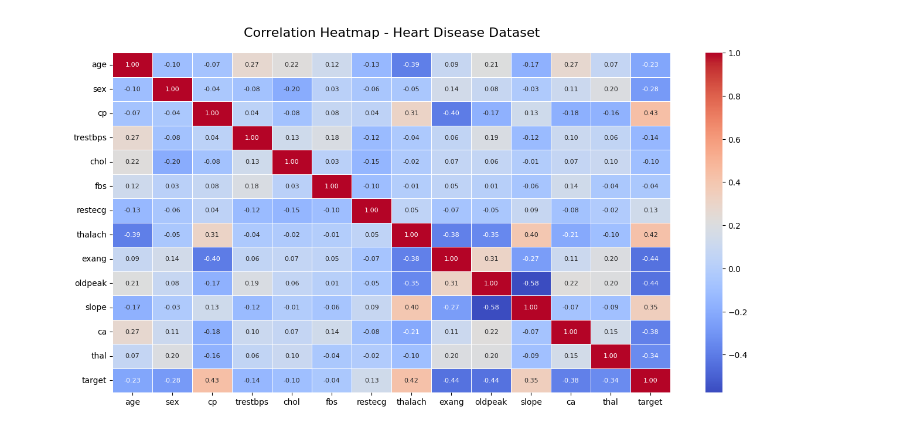

## random-forest-heart

## 📌 Overview
This project uses **Machine Learning** to predict the presence of heart disease based on medical data.  
It is implemented in **Python** using popular libraries such as **pandas, scikit-learn, matplotlib, and seaborn**.  
The dataset used is `heart.csv`.

---

## 📂 Dataset
The dataset contains various medical attributes such as:
- Age
- Sex
- Chest Pain Type (cp)
- Resting Blood Pressure (trestbps)
- Cholesterol (chol)
- Fasting Blood Sugar (fbs)
- Resting ECG (restecg)
- Max Heart Rate Achieved (thalach)
- Exercise Induced Angina (exang)
- ST Depression (oldpeak)
- Slope of ST Segment (slope)
- Number of Major Vessels (ca)
- Thalassemia (thal)
- Target (0 = No Disease, 1 = Disease)

---

## 🚀 How to Run the Project

### 1️⃣ Clone the Repository
```bash
git clone https://github.com/<your-username>/<your-repo-name>.git
cd <your-repo-name>
```

### 2️⃣ Install Python
Make sure you have **Python 3.8+** installed.  
Check version:
```bash
python --version
```

### 3️⃣ Create a Virtual Environment (Optional but Recommended)
```bash
python -m venv venv
```
Activate the environment:  
- **Windows**
```bash
venv\Scripts\activate
```
- **Mac/Linux**
```bash
source venv/bin/activate
```

### 4️⃣ Install Required Libraries
```bash
pip install pandas scikit-learn matplotlib seaborn
```

### 5️⃣ Place the Dataset
Ensure the `heart.csv` file is in the project directory.

### 6️⃣ Run the Project
```bash
python heart_prediction.py
```

---

## 🛠 Features
- **Data Preprocessing**: Handling missing values, encoding categorical features.
- **Exploratory Data Analysis (EDA)**: Visualizing data trends.
- **Model Training**: Logistic Regression, Decision Tree, Random Forest.
- **Model Evaluation**: Accuracy, Confusion Matrix.

---

## 📷 Output Example
**

---

## 👨‍💻 Author
- **kavyakambhampati**
# random-forest-heart
This project uses **Machine Learning** to predict the presence of heart disease based on medical data.   It is implemented in **Python** using popular libraries such as **pandas, scikit-learn, matplotlib, and seaborn**.   The dataset used is `heart.csv`.
